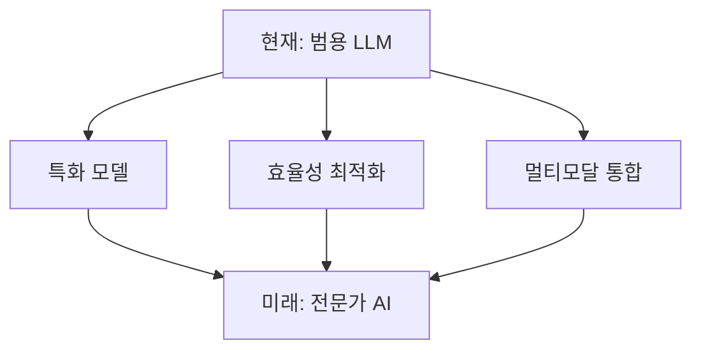

# LLM (Large Language Model) 완전 정복 가이드


## 📚 목차
1. [LLM이란 무엇인가?](#llm이란-무엇인가)
2. [LLM의 핵심 구조](#llm의-핵심-구조)
3. [Transformer 아키텍처](#transformer-아키텍처)
4. [훈련 과정](#훈련-과정)
5. [주요 LLM 모델들](#주요-llm-모델들)
6. [실제 활용 사례](#실제-활용-사례)
7. [한계와 도전 과제](#한계와-도전-과제)

---

## 🤖 LLM이란 무엇인가?

**Large Language Model(대형 언어 모델)**은 방대한 텍스트 데이터로 훈련된 딥러닝 모델로, 인간과 유사한 방식으로 언어를 이해하고 생성할 수 있는 AI 시스템입니다.

### 주요 특징
- **규모**: 수십억 개의 매개변수 (GPT-3는 1750억 개)
- **다양성**: 텍스트 생성, 번역, 요약, 질의응답 등 다양한 작업 수행
- **학습 방식**: 비지도 학습을 통한 패턴 학습


---

## 🧠 LLM의 핵심 구조

### 1. 토큰화 (Tokenization)


```
입력 텍스트: "Hello, world!"
토큰화 결과: ["Hello", ",", " world", "!"]
```

### 2. 임베딩 (Embedding)
- 각 토큰을 고차원 벡터로 변환
- 의미적 유사성을 수치로 표현

### 3. 신경망 레이어
- **인코더**: 입력 이해
- **디코더**: 출력 생성
- **어텐션 메커니즘**: 중요한 정보에 집중

---

## 🔄 Transformer 아키텍처


### Attention 메커니즘 시각화


### Self-Attention 메커니즘
```python
# 간단한 어텐션 개념
def attention(query, key, value):
    # 쿼리와 키의 유사도 계산
    scores = dot_product(query, key)
    # 소프트맥스로 가중치 계산
    weights = softmax(scores)
    # 가중합으로 최종 출력
    output = weighted_sum(weights, value)
    return output
```

### 핵심 구성 요소
1. **Multi-Head Attention**: 여러 관점에서 동시 분석
2. **Position Encoding**: 단어의 위치 정보 인코딩
3. **Feed Forward Network**: 비선형 변환
4. **Layer Normalization**: 안정적인 학습

---

## 📈 훈련 과정

### 1. 사전 훈련 (Pre-training)
### 1. 사전 훈련 (Pre-training)
📊 LLM 훈련 과정 (Training Process)
┌─────────────────────────────────────────────────────────┐
│                                                         │
│  📚 대용량 텍스트 데이터 (수조 개 토큰)                   │
│           ↓                                             │
│  🔤 토큰화 (Tokenization)                               │
│     "Hello world" → ["Hello", ",", " world"]            │
│           ↓                                             │
│  🎯 다음 단어 예측 학습 (Next Token Prediction)           │
│     입력: "The cat is"  →  예측: "sleeping"              │
│           ↓                                             │
│  ⚙️ 기본 언어 모델 완성                                  │
│     (GPT, BERT, LLaMA 등)                               │
│                                                         │
└─────────────────────────────────────────────────────────┘


- **목표**: 다음 단어 예측 (Next Token Prediction)
- **데이터**: 웹 크롤링, 책, 뉴스 등 수조 개의 토큰
- **손실 함수**: Cross-entropy Loss

### 2. 미세 조정 (Fine-tuning)
- **지도 학습**: 특정 작업에 맞는 데이터로 추가 훈련
- **강화 학습**: RLHF (Reinforcement Learning from Human Feedback)

### 3. 프롬프트 엔지니어링
```
입력 예시:
"다음 문장을 한국어로 번역하세요: 'Hello, how are you?'"

출력:
"안녕하세요, 어떻게 지내세요?"
```

---

## 🌟 주요 LLM 모델들

| 모델 | 개발사 | 매개변수 수 | 특징 |
|------|--------|-------------|------|
| **GPT-4** | OpenAI | ~1조 개 | 멀티모달, 높은 성능 |
| **Claude** | Anthropic | 미공개 | 안전성 중시, 긴 컨텍스트 |
| **LLaMA 2** | Meta | 7B-70B | 오픈소스, 높은 효율성 |
| **PaLM 2** | Google | 340B | 다국어 지원 |
| **GPT-3.5** | OpenAI | 175B | ChatGPT 기반 |

### 모델 크기별 성능 변화


```
매개변수 수 ↑ → 성능 ↑ (하지만 비용도 ↑)

1B → 10B → 100B → 1T
기본 → 향상 → 고성능 → 최고 성능
```

---

## 💡 실제 활용 사례

### 1. 콘텐츠 생성
- **블로그 작성**: 아이디어부터 완성된 글까지
- **코딩 지원**: GitHub Copilot, ChatGPT Code Interpreter
- **창작 활동**: 소설, 시나리오, 마케팅 카피

### 2. 업무 자동화
```python
# 이메일 자동 요약 예시
def summarize_email(email_content):
    prompt = f"다음 이메일을 3줄로 요약해주세요:\n{email_content}"
    return llm_api_call(prompt)
```

### 3. 교육 분야
- **개인화 학습**: 학습자 수준에 맞는 설명
- **언어 학습**: 회화 연습, 문법 교정
- **과제 도움**: 개념 설명, 문제 해결 가이드

### 4. 고객 서비스
- **챗봇**: 24/7 고객 지원
- **FAQ 자동화**: 반복적인 질문 처리
- **감정 분석**: 고객 피드백 분석

---

## ⚠️ 한계와 도전 과제

### 1. 기술적 한계
- **할루시네이션**: 그럴듯하지만 틀린 정보 생성
- **컨텍스트 제한**: 긴 대화나 문서 처리의 어려움
- **실시간 정보 부족**: 학습 시점 이후 정보 모름

### 2. 윤리적 고려사항
```
편향성 문제:
훈련 데이터의 편향 → 모델 출력의 편향
예: 성별, 인종, 문화적 편향

해결 방안:
- 다양한 데이터 수집
- 공정성 평가 지표
- 지속적인 모니터링
```

### 3. 경제적 영향
- **고비용**: 훈련과 운영에 막대한 비용
- **에너지 소비**: 환경적 영향 고려 필요
- **일자리 변화**: 자동화로 인한 직업 구조 변화

---

## 🚀 미래 전망


### 차세대 기술
1. **멀티모달 AI**: 텍스트 + 이미지 + 음성 + 비디오
2. **에이전트 AI**: 복잡한 작업 자동 수행
3. **개인화**: 개별 사용자 맞춤형 모델
4. **효율성**: 더 작으면서도 강력한 모델

### 개발 동향


---

## 📖 학습 로드맵

### 초급자
1. **기본 개념** 이해 (이 문서)
2. **ChatGPT/Claude** 실습
3. **프롬프트 엔지니어링** 연습

### 중급자
1. **Transformer 아키텍처** 심화 학습
2. **Hugging Face** 라이브러리 활용
3. **Fine-tuning** 실습

### 고급자
1. **모델 아키텍처** 설계
2. **대규모 훈련** 파이프라인 구축
3. **연구 논문** 구현 및 개선

---

## 🔗 추가 학습 자료

### 온라인 강의
- [Stanford CS224N: NLP with Deep Learning](https://web.stanford.edu/class/cs224n/)
- [Hugging Face NLP Course](https://huggingface.co/course)
- [Fast.ai Practical Deep Learning](https://www.fast.ai/)

### 실습 플랫폼
- **Hugging Face**: 모델 허브와 실습 환경
- **Google Colab**: 무료 GPU 환경
- **Kaggle**: 데이터셋과 컴페티션

### 주요 논문
- "Attention Is All You Need" (Transformer)
- "BERT: Pre-training of Deep Bidirectional Transformers"
- "Language Models are Few-Shot Learners" (GPT-3)

---

## 💼 실무 적용 팁

### 1. 효과적인 프롬프트 작성
```
좋은 예:
"마케팅 이메일을 작성해주세요. 
대상: 20-30대 직장인
제품: 프리미엄 커피 구독 서비스
톤: 친근하고 전문적
길이: 200단어 이내"

나쁜 예:
"이메일 써줘"
```

### 2. 품질 관리
- **여러 번 시도**: 다양한 결과 비교
- **사실 확인**: 중요한 정보는 반드시 검증
- **맥락 제공**: 충분한 배경 정보 제공

### 3. 비용 최적화
- **적절한 모델 선택**: 작업에 맞는 크기의 모델
- **배치 처리**: 여러 요청을 한 번에 처리
- **캐싱**: 반복되는 결과 저장

---
